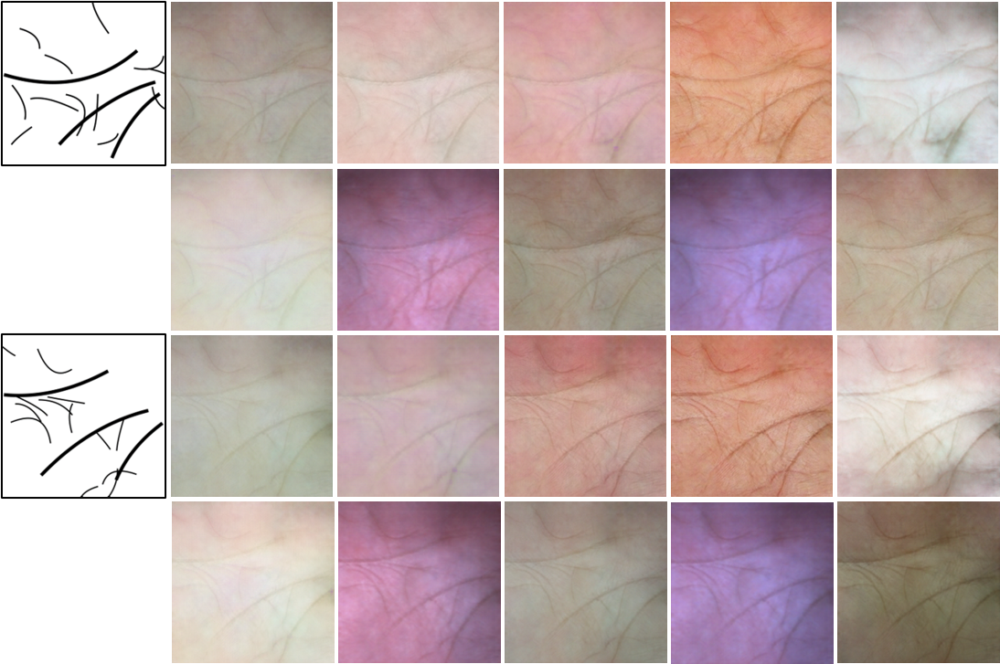

# RPG-Palm
`RPG-Palm Realistic Pseudo-data Generation for Palmprint Recognition` |  [Paper](https://openaccess.thecvf.com/content/ICCV2023/papers/Shen_RPG-Palm_Realistic_Pseudo-data_Generation_for_Palmprint_Recognition_ICCV_2023_paper.pdf)

Pytorch implementation for RPG-Palm .

## Example results
  


## Prerequisites
- Python 3.10
<!-- - CPU or NVIDIA GPU + CUDA CuDNN -->

## Getting Started ###

<!-- This code borrows heavily from the [BicycleGAN](https://github.com/junyanz/BicycleGAN/tree/master) repository. You can find more details about the original code in the [BicycleGAN](https://github.com/junyanz/BicycleGAN) repository. -->

### Installation
- Clone this repo:
```bash
git clone https://github.com/Shivam067/IPR_210980_Part2.git
cd IPR_210980_Part2
``` 

- I have used CUDA Toolkit 12.4 with cuDNN for CUDA 12.4, you can follow this medium article to setup cuda [link](https://medium.com/@harunijaz/a-step-by-step-guide-to-installing-cuda-with-pytorch-in-conda-on-windows-verifying-via-console-9ba4cd5ccbef)

- To download CUDA 12.4, click [Here](https://developer.nvidia.com/cuda-12-4-0-download-archive?target_os=Windows&target_arch=x86_64&target_version=11&target_type=exe_local)
- To download cuDNN for the above CUDA, In the [Link](https://developer.nvidia.com/rdp/cudnn-archive), select `Download cuDNN v8.9.7   (December 5th, 2023), for CUDA 12.x` and download accordingly. Now you have to replace some files from this cuDNN into your CUDA path as told in the above medium article link, Follow it.
- Install PyTorch and dependencies from http://pytorch.org, or use this-
```
conda install pytorch torchvision torchaudio pytorch-cuda=12.4 -c pytorch -c nvidia
```

- Verify cuda availability
```
python -c "import torch; print(torch.cuda.is_available())"
python -c "import torch; print(torch.version.cuda)"
python -c "import torch; print(torch.backends.cudnn.version())"
```


- Install python libraries [visdom](https://github.com/facebookresearch/visdom), [dominate](https://github.com/Knio/dominate), and [moviepy](https://github.com/Zulko/moviepy) or run requirement.txt.

```
pip install -r requirements.txt
```

- **Noted that do not install vlkit from pypi**, because it is not compatible with the current version. Please install vlkit as following:
```bash
pip install palm-recognition/vlkit-0.1.0b11.tar.gz 
```

### Use a Pre-trained Model
- Download [checkpoints](https://drive.google.com/file/d/1Za7ZBfjAKkFe5j0HRD9C36nOnp550dlx/view?usp=sharing) (maybe you have to request it first) and place it in `./checkpoints `.

- Then `bash ./run_rpg.sh`

- While running this command, if any labrary is missing, please install it through `pip install`

- I am runing the pretrained model, because to train this model, It requires 13 different palm-print datasets, some of them are not even available.
- This script file also run the test.py file, which at the end produces two folders- bezier_rpg which contains the results, and datasets which contains the initial bezier creases.
<!-- - Noted that you should modify some contents in `./run_rpg.sh` to meet you requirements. -->

<!-- ### Model Training
- To train a model,
```bash
bash train.sh
```
- To view training results and loss plots, run `python -m visdom.server` and click the URL http://localhost:8097. To see more intermediate results, check out  `./checkpoints/NAME/web/index.html` -->


<!-- ### Citation

If you find this useful for your research, please use the following.

```
@inproceedings{shen2023rpg,
  title={RPG-Palm: Realistic Pseudo-data Generation for Palmprint Recognition},
  author={Shen, Lei and Jin, Jianlong and Zhang, Ruixin and Li, Huaen and Zhao, Kai and Zhang, Yingyi and Zhang, Jingyun and Ding, Shouhong and Zhao, Yang and Jia, Wei},
  booktitle={Proceedings of the IEEE/CVF International Conference on Computer Vision},
  pages={19605--19616},
  year={2023}
}
```

If you have any questions or encounter any issues with the RPG-PALM code, please feel free to contact me (email: jianlong@mail.hfut.edu.cn). 
I would be more than happy to assist you in any way I can.

### Acknowledgements

This code borrows heavily from the [BicycleGAN](https://github.com/junyanz/BicycleGAN/tree/master) repository. -->
